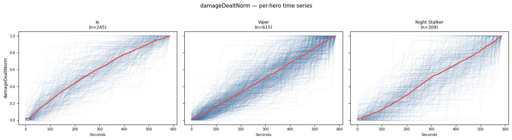
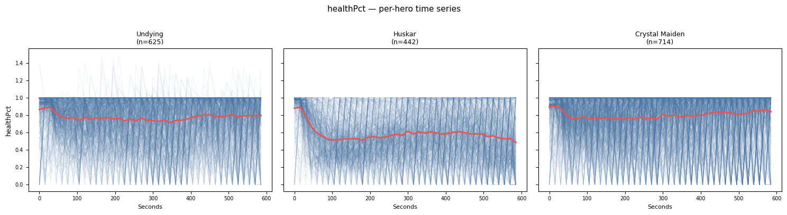
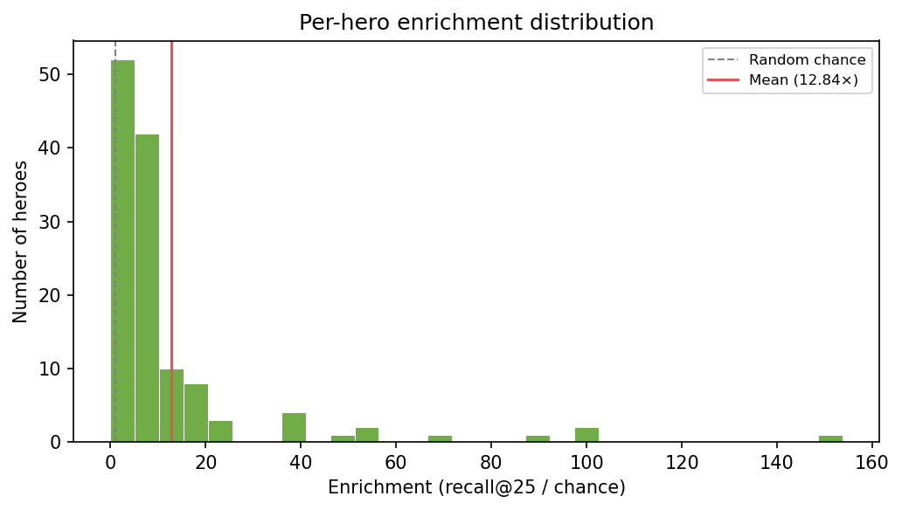
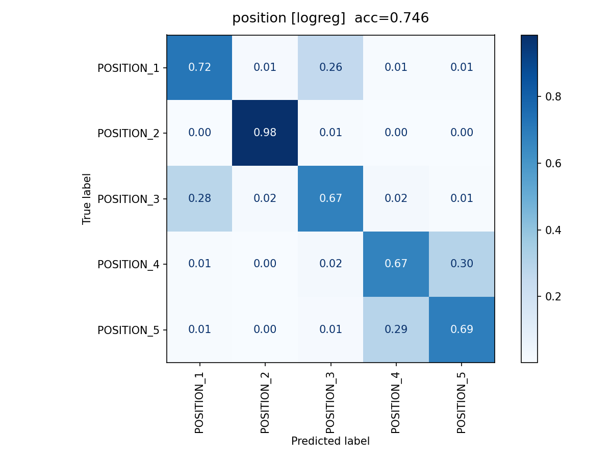
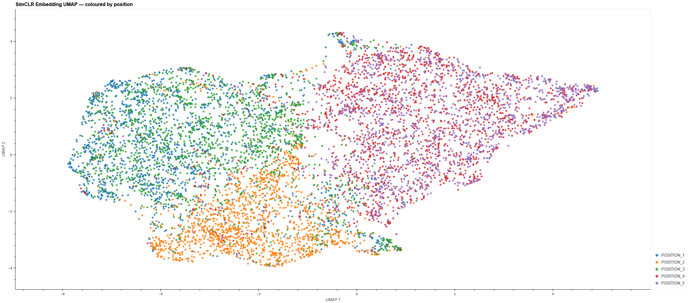
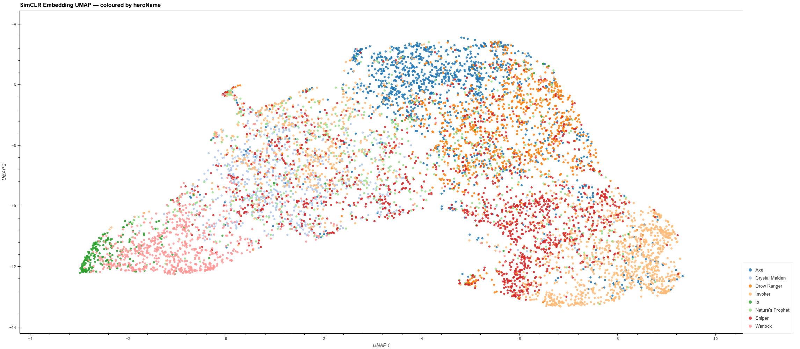
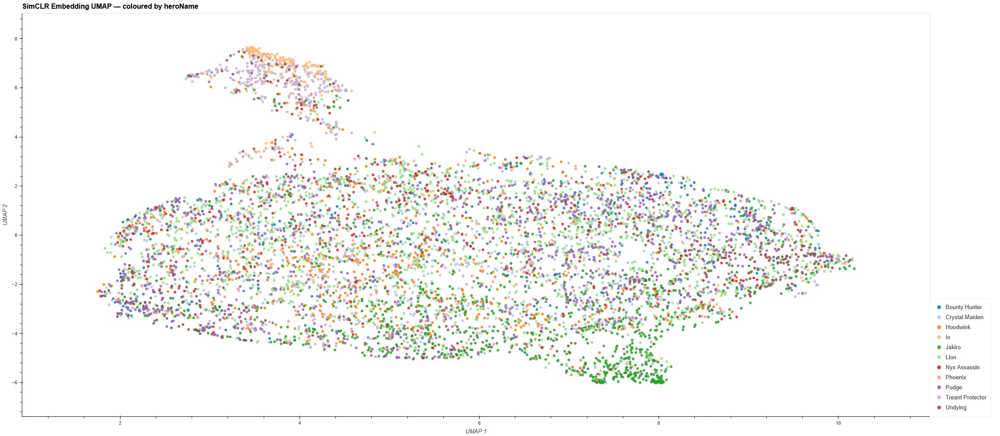
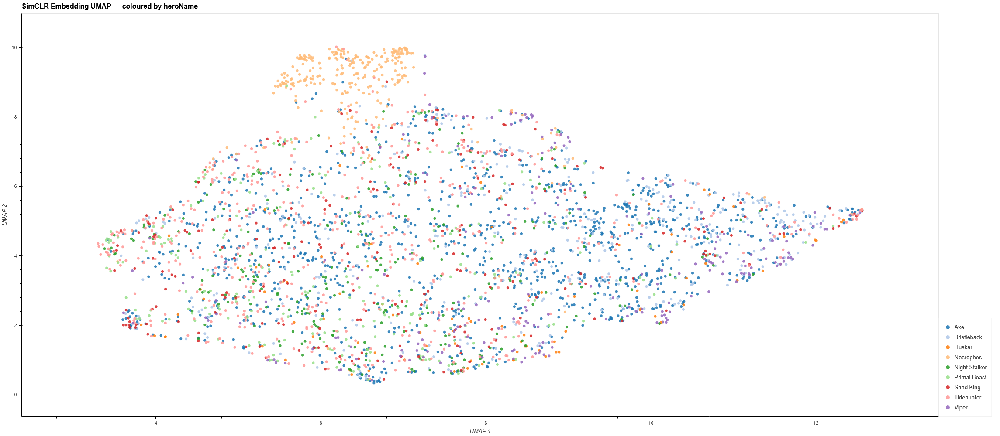

## Goal

The goal was to find clustering in the embedding space that captures different playstyles in the laning stage ,
not only hero and role, but also *how* a hero is played in a given role.
An Io pos 5 is likely to sit close behind their carry in lane, providing regen to succeed in lane,
while a Tusk pos 5 is more likely to play aggressively and possibly roam to other lanes.

A SimCLR encoder was trained on 77k player time series from Divine-bracket matches in patches 7.40 through 7.40c. No role labels, no hero annotations, no outcome signals were used during training. After training, the embedding space was evaluated against ground-truth labels to measure how much structure the model recovered.


---

## Features

Each player's laning phase is represented as two components fed jointly into the encoder:

- **Time series**: 18 feature channels × 40 time steps (one per 15 seconds, covering the first 10 minutes): gold, XP, hero damage dealt/taken, CS, tower damage, healing, health%, mana%, distance to nearest ally/enemy/tower, kills/deaths/assists/ability casts, allies/enemies nearby.
- **Scalars**: 7 end-of-phase summary statistics: peak gold, XP, hero damage dealt/taken, CS, tower damage, healing.




Plotting our normalized time series features by hero helps validate the data. Io's damage curve shows poor damage scaling, while Night Stalker has a distinctive elbow at the beginning of daytime. We can also see that Undying is able to reach health percentages above 100% from Decay and that Huskar tends to sit at a lower health percentage than other heroes.

### Feature importance

Before any model training, normalized mutual information (NMI = I(X;Y) / H(Y)) was computed between each raw feature and each outcome label. NMI is bounded [0, 1], where 1.0 means the feature alone perfectly predicts the target.


Key findings:
- **Distance to nearest tower** (NMI ~0.51) and **CS** (NMI ~0.38) are the strongest individual predictors of **role**. Distance to nearest ally (~0.27), gold (~0.29), and XP scalars (~0.26) are secondary.
- **For lane outcome**, the story is different: **gold** is the top predictor (NMI ~0.12), followed by XP scalars (~0.07). Tower distance and CS, while strong role signals, have little lane outcome information (~0.04).
- **Mana%** (NMI ~0.15) is the strongest individual predictor of **hero identity**, likely driven by heroes with distinctive mana patterns (e.g., mana-hungry heroes, innate regen).
- **All features have weak predictive power for match outcome** (max NMI ~0.015), suggesting win/loss is not determined by individual laning features alone.

→ Full analysis: [`evaluation/feature_analysis.ipynb`](evaluation/feature_analysis.ipynb)

---

## Representation learning

**Model:** SimCLR (Chen et al., 2020). Two randomly augmented views of the same player's time series are treated as a positive pair. The encoder learns to agree on their representation while pushing apart all other players in the batch (NT-Xent loss). No labels are used at any point during training.

**Augmentations:** Each view is produced by independently sampling the following pipeline:

| Augmentation | What it does | Probability |
|---|---|---|
| Gaussian noise | Adds i.i.d. noise (σ=0.03) to all channels | 0.8 |
| Feature masking | Zeros out randomly selected feature channels (15% channel drop rate) | 0.7 |
| Scale jitter | Multiplies continuous channels (0–11) by independent random scale factors in [0.85, 1.15] | 0.6 |
| Temporal shift | Rolls all channels along the time axis by ±1 step | 0.5 |
| Timestep dropout | Zeros out randomly selected timestep columns (10% drop rate, max 3 of 40) | 0.5 |

The augmentations are designed to simulate realistic measurement noise and partial observability while preserving the semantic content (role, lane, playstyle) that we want the encoder to be invariant to. Count channels (kills, deaths, assists, etc.) are excluded from scale jitter since scaling integer counts is not meaningful.

**Architecture:**
```
ts (18, 40) ──► Conv1d stack ──► AdaptiveAvgPool ──┐
scalars (7,) ──► Linear + BN ──────────────────────┴──► Linear ──► h (256-dim embedding)
                                                                        │
                                                              ProjectionHead (MLP)
                                                                        │
                                                               z  ← NT-Xent loss
```

**Data:** ~10k matches from the STRATZ GraphQL API (Divine bracket). After filtering rows with unknown hero/role/lane outcome: **77,080 player samples**.

---

## Evaluating the embeddings

### Nearest-neighbor consistency check

Nearest-neighbor consistency (k=25, cosine distance) on the full embedding space. Per-role breakdown:

| Position | Role | recall@25 | chance | enrichment |
|---|---|---|---|---|
| POSITION_2 | Mid | 0.833 | 0.200 | **4.17×** |
| POSITION_1 | Safe carry | 0.539 | 0.200 | 2.70× |
| POSITION_3 | Offlaner | 0.502 | 0.200 | 2.51× |
| POSITION_5 | Hard support | 0.498 | 0.200 | 2.49× |
| POSITION_4 | Soft support | 0.494 | 0.200 | 2.47× |

Mean enrichment by label type:

| Label | Classes | Mean recall@25 | Mean enrichment |
|---|---|---|---|
| Hero | 128 | 0.070 | **12.84×** |
| Coarse role (mid / side core / support) | 3 | 0.888 | **2.91×** |
| Role / position | 5 | 0.573 | **2.87×** |
| Lane outcome | 5 | 0.349 | **2.31×** |
| Coarse lane outcome (win / loss / tie) | 3 | 0.502 | **1.47×** |
| Match outcome | 2 | 0.522 | **1.04×** |


**Role** is the most clearly encoded label. Coarse role and fine-grained role have nearly identical mean enrichment (2.91× vs 2.87×), which reveals a hierarchical structure: the model learned the three coarse groups (mid, side cores, supports) cleanly, and within each group the representations are essentially flat.

**Lane outcome** enrichment (2.31×) is misleadingly high as a summary. The signal is concentrated almost entirely in the stomp outcomes. Regular wins and losses are much harder to separate. This is confirmed by the coarse version (1.47×): merging stomp outcomes into their regular counterparts collapses enrichment sharply, because it mixes the informative minority into a much larger, weakly-structured class.

**Match outcome** (1.04×) is indistinguishable from random. Consistent with the feature importance finding that all raw features have near-zero NMI with match outcome.


**Hero** enrichment (12.84x) is a misleading value since the chance baseline is so low (~.008). There is definitely some clustering going on, but inspecting the per-hero enrichment reveals that this number is held up by a small number of highly-clustered heroes.



→ Full analysis: [`evaluation/nn_consistency.ipynb`](evaluation/nn_consistency.ipynb)

### Linear probing on frozen embeddings

Logistic regression and XGBoost classifiers were trained on top of frozen SimCLR embeddings. We see that the embeddings have excellent predictive power for distinguishing side lane cores, supports, and mids. However the models struggle to distinguish Safe carry (pos 1) from Offlaner (pos 3) and Soft support (pos 4) from Hard support (pos 5).



### UMAP of the embedding space

Plotting out the embedding space in a UMAP projection reinforces our conclusions from the classification analysis:

We see very distinct clusters of mid players, support players, and side lane core players. However, there is very little distinction between the two support roles or between the two side core roles.

Does our embedding space capture the distinctive playstyles of different heroes?

If we restrict the embedding space to a smaller subset of heroes. We see distinct separation between the heroes with clear roles and playstyles, while Nature's Prophet, who is more versatile than the rest, as points scattered throughout the space.


Now if we look at only heroes traditionally played as supports (though with different laning strategies). Io and Treant are clustered apart from the rest, but that is explained by their ability to heal their laning partners. We also see some clustering on Jakiro, I'm not sure what explains that. For the rest, we see little to no separation.


Finally, if we look at traditional offlane heroes, we see a similar story. Necrophos is clustered away from the rest, again presumably because of his ability to heal teammates. The rest of the heroes are spread out pretty uniformly through the embedding space.

---

## Conclusion

The laning phase contains enough behavioral signal for a self-supervised encoder to recover coarse role structure without any labels. The three broad groups, mid, side cores, and supports, are clearly separated in the embedding space. Within each group, fine-grained identity is not recoverable, which in hindsight makes a lot of sense. I know that I don't play pos 4 and pos 5 differently enough that they might be consistently separated by these features. Plus the sheer variety of lane matchups and their impacts on playstyle add too much noise to the data to be able to distinguish the roles.

Overall I think it's clear that there's some geometry in this embedding space, but it's pretty noisy.

---

## What's next

I have two ideas for further exploration:
First, I think my features might be too coarse to capture some of the more subtle behaviors in lane. For example, pulling, dragging, or shoving waves probably wouldn't be represented by the existing features.
Adding more features like distance to creep wave and perhaps distance to second closest enemy hero would help. Though I'm reluctant to add too many features based on domain knowledge since that might be forgetting the "Bitter Lesson".

Second, player behavior is pretty restricted in the laning phase. There's only so many ways you can play that part of the game when you are essentially restricted to a single lane. We might see the existing features have stronger descriptive power if we slide the time window from 0-10 minutes to 10-20 minutes.

---

## Project structure

| Directory | Description |
|---|---|
| [`extraction/`](extraction/README.md) | Fetch match IDs from OpenDota; extract laning features from STRATZ GraphQL |
| [`training/`](training/README.md) | SimCLR training loop, model architecture, augmentations |
| [`evaluation/`](evaluation/README.md) | UMAP explorer, NN consistency notebook, feature importance notebook, linear probing |
| `figures/` | All output figures and CSVs from evaluation runs |
| `data/` | Match database (not tracked) |
| `checkpoints/` | Model checkpoints (not tracked) |

---

## Reproducing

### 1. Environment

```bash
micromamba activate dota   # or: conda activate dota
pip install requests python-dotenv tqdm torch umap-learn panel holoviews bokeh scikit-learn xgboost jupyter
```

Add your STRATZ API token to `.env`:
```
STRATZ_TOKEN=your_token_here
```

### 2. Extract data

```bash
python extraction/fetch_match_ids.py --patch 7.40 --bracket divine --count 1000
python extraction/extract_match.py \
    --match-ids-file data/match_lists/match_ids_740_divine.txt \
    --store sqlite --db ./data/matches.db
```

### 3. Train

```bash
python training/train.py \
    --data ./data/matches.db \
    --epochs 250 --batch-size 512 --lr 5e-4
```

### 4. Evaluate

```bash
# Feature importance
jupyter notebook evaluation/feature_analysis.ipynb

# NN consistency check
jupyter notebook evaluation/nn_consistency.ipynb

# Interactive UMAP
python evaluation/umap_embeddings.py --data ./data/matches.db

# Linear probing
python evaluation/embedding_analysis.py --data ./data/matches.db
```
