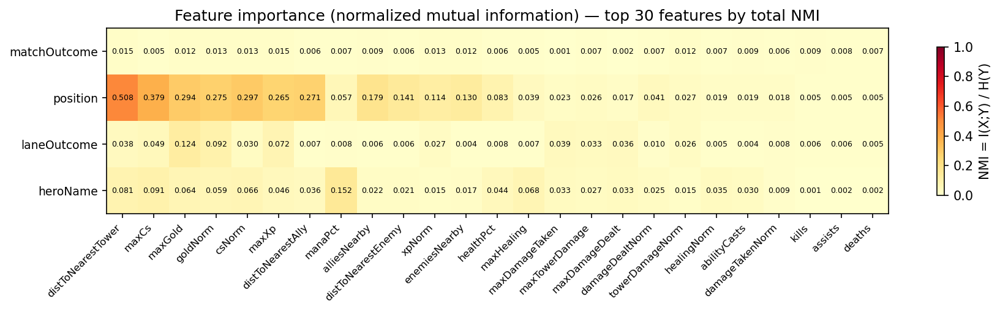

# dota_emb

Can a neural network learn what role a Dota 2 player is filling — without ever being told? This project trains a self-supervised encoder on raw laning-phase behavior and evaluates whether the learned representations organize players by role, lane outcome, and play style without any labels during training.

---

## Goal

The central question is whether the *behavioral signature* of a player's laning phase — their movement, economy, combat, and positioning over 10 minutes — is distinctive enough that a model can learn a useful representation of it unsupervised.

A SimCLR encoder is trained on 77k player time series from Divine-bracket matches. No role labels, no hero annotations, no outcome signals are used during training. After training, the embedding space is evaluated against ground-truth labels to measure how much structure the model recovered.

---

## Features

Each player's laning phase is represented as two components fed jointly into the encoder:

- **Time series** — 18 feature channels × 40 time steps (one per 15 seconds, covering the first 10 minutes): gold, XP, damage dealt/taken, CS, tower damage, healing, health%, mana%, distance to nearest ally/enemy/tower, kills/deaths/assists/ability casts, allies/enemies nearby.
- **Scalars** — 7 end-of-phase summary statistics: peak gold, XP, damage dealt/taken, CS, tower damage, healing.

### Feature importance

Before any model training, normalized mutual information (NMI = I(X;Y) / H(Y)) was computed between each raw feature and each outcome label. NMI is bounded [0, 1], where 1.0 means the feature alone perfectly predicts the target.



Key findings:
- **Distance to nearest tower** (NMI ~0.59) and **distance to nearest ally** (NMI ~0.40) are the strongest individual predictors of role and lane.
- **Gold and XP scalars** are secondary role predictors, reflecting farm accumulation differences between carries and supports.
- **All features have weak predictive power for match outcome** (max NMI ~0.02), suggesting win/loss is determined by factors beyond the laning phase or not captured in these features alone.

→ Full analysis: [`evaluation/feature_analysis.ipynb`](evaluation/feature_analysis.ipynb)

---

## Representation learning

**Model:** SimCLR (Chen et al., 2020). Two randomly augmented views of the same player's time series are treated as a positive pair. The encoder learns to agree on their representation while pushing apart all other players in the batch (NT-Xent loss). No labels are used at any point during training.

**Architecture:**
```
ts (18, 40) ──► Conv1d stack ──► AdaptiveAvgPool ──┐
scalars (7,) ──► Linear + BN ──────────────────────┴──► Linear ──► h (256-dim embedding)
                                                                        │
                                                              ProjectionHead (MLP)
                                                                        │
                                                               z  ← NT-Xent loss
```

**Data:** ~10k matches from the STRATZ GraphQL API (Divine bracket). After filtering rows with unknown hero/role/lane outcome: **77,080 player samples**.

---

## Evaluating the embeddings

### Embeddings cluster by role without supervision

Nearest-neighbor consistency check (k=25, cosine distance) on the full embedding space:

| Position | Role | recall@25 | chance | enrichment |
|---|---|---|---|---|
| POSITION_2 | Mid | 0.833 | 0.200 | **4.17×** |
| POSITION_1 | Safe carry | 0.539 | 0.200 | 2.70× |
| POSITION_3 | Offlaner | 0.502 | 0.200 | 2.51× |
| POSITION_5 | Hard support | 0.498 | 0.200 | 2.49× |
| POSITION_4 | Soft support | 0.494 | 0.200 | 2.47× |

**Mean enrichment: 2.87×** — neighbors share your role nearly 3× more often than chance.

The results reveal a clear split between **coarse role structure** (well recovered) and **fine-grained role identity** (not recovered):

- **Mid (pos 2)** is by far the most distinctive role (enrichment 4.17×). Its signature is unique: isolated 1v1 laning, a sharp individual XP curve, and no allied presence nearby.
- **Safe carry (pos 1) and offlaner (pos 3)** are meaningfully separated from the rest (enrichment ~2.5–2.7×), but their laning patterns share enough overlap that they aren't sharply distinct from each other.
- **Soft support (pos 4) and hard support (pos 5)** have nearly identical enrichment (~2.47–2.49×) and similar recall. The model can tell they are *supports* — they cluster together away from cores — but cannot reliably distinguish *which* support role. During the laning phase, both roles share the same lane, the same spatial signature, and similar economic profiles. **Intragroup variance within the support pairing outweighs the intergroup variance between pos 4 and pos 5**, leaving no behavioral signal for the model to separate them on.

The conclusion is that the laning phase encodes enough structure to recover coarse role groupings (carry/mid/support) without supervision, but the 0–10 minute window does not contain enough differential signal to resolve fine-grained identity within those groups.

→ Full analysis: [`evaluation/nn_consistency.ipynb`](evaluation/nn_consistency.ipynb)

### Linear probing on frozen embeddings

Logistic regression and XGBoost classifiers trained on top of frozen SimCLR embeddings. Tests whether role and outcome information is linearly decodable from the representation. Confusion matrices saved to [`evaluation/analysis/`](evaluation/analysis/).

### UMAP of the embedding space

Interactive UMAP visualization (Panel/Bokeh app). Points colored by role, hero, lane outcome, etc. Legend entries are clickable to mute/isolate categories.

<!-- Add UMAP screenshot here: figures/umap_position.png -->

---

## What's next

The laning phase (0–10 min) result is a clean baseline, but it has a structural limitation: roles that share a lane share a behavioral signature. The natural next question is whether the **post-laning phase (10–20 min)** contains more discriminative signal, since by that point supports and carries have diverged in movement patterns, farm distribution, and map presence.

This is being investigated in the [`experiment/post-laning-10-20min`](../../tree/experiment/post-laning-10-20min) branch. The hypothesis is that role separation will improve for pos 4 vs pos 5 (they are now playing differently across the map) but may degrade for other dimensions as general teamfight behavior starts to converge across positions.

---

## Project structure

| Directory | Description |
|---|---|
| [`extraction/`](extraction/README.md) | Fetch match IDs from OpenDota; extract laning features from STRATZ GraphQL |
| [`training/`](training/README.md) | SimCLR training loop, model architecture, augmentations |
| [`evaluation/`](evaluation/README.md) | UMAP explorer, NN consistency notebook, feature importance notebook, linear probing |
| `figures/` | All output figures and CSVs from evaluation runs |
| `data/` | Match database (not tracked) |
| `checkpoints/` | Model checkpoints (not tracked) |

---

## Reproducing

### 1. Environment

```bash
micromamba activate dota   # or: conda activate dota
pip install requests python-dotenv tqdm torch umap-learn panel holoviews bokeh scikit-learn xgboost jupyter
```

Add your STRATZ API token to `.env`:
```
STRATZ_TOKEN=your_token_here
```

### 2. Extract data

```bash
python extraction/fetch_match_ids.py --patch 7.40 --bracket divine --count 1000
python extraction/extract_match.py \
    --match-ids-file data/match_lists/match_ids_740_divine.txt \
    --store sqlite --db ./data/matches.db
```

### 3. Train

```bash
python training/train.py \
    --data ./data/matches.db \
    --epochs 250 --batch-size 512 --lr 5e-4
```

### 4. Evaluate

```bash
# Feature importance
jupyter notebook evaluation/feature_analysis.ipynb

# NN consistency check
jupyter notebook evaluation/nn_consistency.ipynb

# Interactive UMAP
python evaluation/umap_embeddings.py --data ./data/matches.db

# Linear probing
python evaluation/embedding_analysis.py --data ./data/matches.db
```
